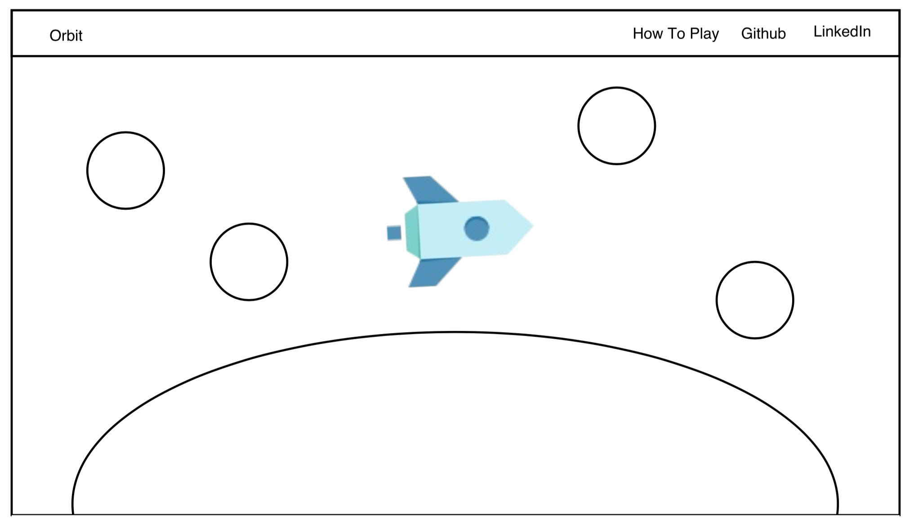

## Orbit

### Background

Orbit follows the journey of a rocket that is orbiting the moon. The survival of the rocket, whose position is controlled by the user's mouse, depends on the avoidance of oncoming asteroids.

### Functionality & MVP  

With this app, users will be able to:

- [ ] Manipulate rocket position with mouse movement

This project will include:

- [ ] A production Readme
- [ ] A modal describing the rules of the game

### Wireframes

This game will consist of a single screen with nav links to the Github repo, my LinkedIn, and the instructional modal. The screen will be set around a rotating planet, with the rocket positioned near the center of the screen. Oncoming asteroids will enter from the left. When the user hits an asteroid, the score will appear on the screen along with a Play Again button.

### Architecture and Technologies

This project will be implemented with the following technologies:

- Vanilla JavaScript and `jquery` for overall structure and game logic,
- `Three.js` with `WebGL` for DOM manipulation and rendering,
- Webpack to bundle and serve up the various scripts.

In addition to the webpack entry file, there will be 6 scripts involved in this project:

`lighting.js`: This script will manage the lighting of the scene.

`moon.js`: This script will create the moon object;

`rocket.js`: This script will create the rocket object.

`asteroid.js`: This script will create an asteroid.

`sky.js`: This script will create the sky with randomly dotted asteroids.

`game.js`: This script will house the game logic.

### Implementation Timeline

**Weekend**: Get webpack up and running and install `Three.js`.  Create `webpack.config.js` as well as `package.json`. Write a basic entry file and learn about `Three.js`.

**Day 1**: Add the nav bar. Create the scene and lighting.

**Day 2**: Create rocket and asteroid objects and add them to the scene. Animate the scene.

**Day 3**: Add responsiveness to mouse movement and start on game logic.  

**Day 4**: Continue developing game logic. Create a modal with instructions.
