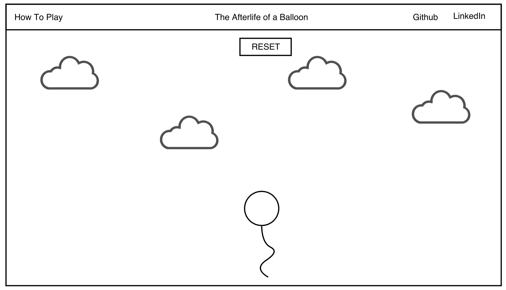

## The Afterlife of a Balloon

### Background

The Afterlife of a Balloon follows the journey of a balloon that was mistakenly released into the heavens by a careless child. The survival of the balloon, whose position is controlled by the user's mouse, depends on avoidance of oncoming clouds.

### Functionality & MVP  

With this app, users will be able to:

- [ ] Start and reset the game
- [ ] Manipulate balloon position with mouse movement

In addition, this project will include:

- [ ] A production Readme
- [ ] A modal describing the rules of the game

### Wireframes

This game will consist of a single screen with nav links to the Github repo, my LinkedIn, and the instructional modal. A start/reset button will be also be present at the top. The screen will be set in the sky, with the balloon positioned near the bottom. Oncoming clouds will enter from the top and the frequency and speed at which they appear will increase as more time passes. At the end of the game, the score will appear on the screen along with a Play Again button.

### Architecture and Technologies

This project will be implemented with the following technologies:

- Vanilla JavaScript and `jquery` for overall structure and game logic,
- `Three.js` with `WebGL` for DOM manipulation and rendering,
- Webpack to bundle and serve up the various scripts.

In addition to the webpack entry file, there will be 5 scripts involved in this project:

`scene.js`: This script will create the scene, the camera, and the renderer.

`lights.js`: This script will manage the lighting of the scene.

`balloon.js`: This script will create the balloon object and add responsiveness to mouse movement.

`clouds.js`: This script will create multiple clouds and add them to the scene.

`game.js`: This script will house the game logic.

### Implementation Timeline

**Day 1**: Get webpack up and running and install `Three.js`.  Create `webpack.config.js` as well as `package.json`. Write a basic entry file and learn the basics of `Three.js`. Create `scene.js` and `lights.js`.

**Day 2**: Create balloon and cloud objects and add them to the scene. Create `clouds.js` and `game.js`.

**Day 3**: Add game logic to `game.js`.

**Day 4**: Add the nav bar and polish the frontend. Create a modal with instructions.
