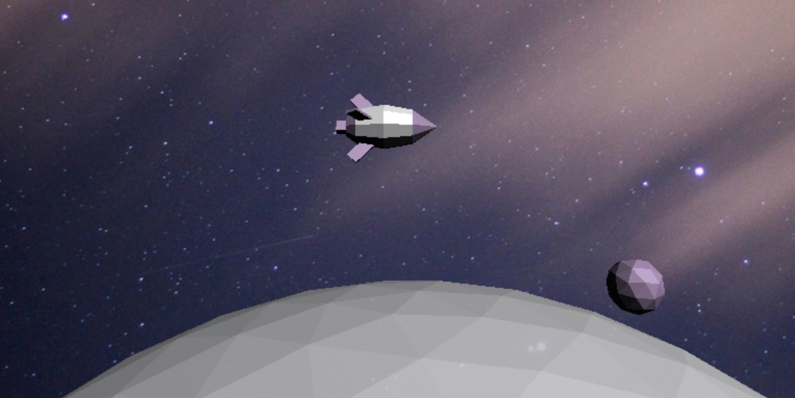

## Orbit

[Orbit Live][orbit]

[orbit]: www.chloejchou.github.io/orbit

Orbit follows the journey of a rocket that is circling the moon. The user is able to toggle the following environmental factors:

* asteroid count
* position on the z-axis
* rocket speed & rotation
* the camera's point of view
* asteroid & moon colors

This project was implemented with JavaScript, jQuery, and Three.js.

### Objects

A `PerspectiveCamera` is initially set up to face a rocket orbiting the moon, which is surrounded by asteroids. The rocket position is static, while the moon and asteroids rotate steadily along the z-axis to give the illusion of a moving rocket.

#### Moon

The moon is an icosahedron that is placed slightly lower than the x-axis so that the camera only captures half the object when zoomed out completely.

#### Asteroids

The asteroids surrounding the moon are also icosahedrons that are assigned a random size and distance. They are placed evenly around the moon. In addition to rotating with the moon along the z-axis, they rotate individually along the y-axis.

```js
const spaceMesh = new THREE.Object3D();

const angleDistance = (Math.PI * 2) / numAsteroids;
for (let i = 0; i < numAsteroids; i++) {
  const angle = angleDistance * i;
  const distance = 325 + (Math.random() * 300);
  const newAsteroid = new Asteroid();
  newAsteroid.sphere.position.x = Math.cos(angle) * distance;
  newAsteroid.sphere.position.y = Math.sin(angle) * distance;
  newAsteroid.sphere.position.z = Math.random() * 100;

  const size = Math.random();
  newAsteroid.sphere.scale.set(size, size, size);
  spaceMesh.add(newAsteroid.sphere);
}
```

#### Rocket

The rocket follows the user's mouse movement and is made up of 9 different objects: 1 cone, 3 cylinders, and 5 boxes. The object spins along the x-axis.

<p align="center" height="100%" width="auto">
  
</p>

### Future Directions
* I plan on animating smoke puffs coming out from the rear of the rocket. Please see this [example][example].

[example]: https://codepen.io/murdoc/pen/aOPaqZ

* I also plan on animating rocket and asteroid collisions.
