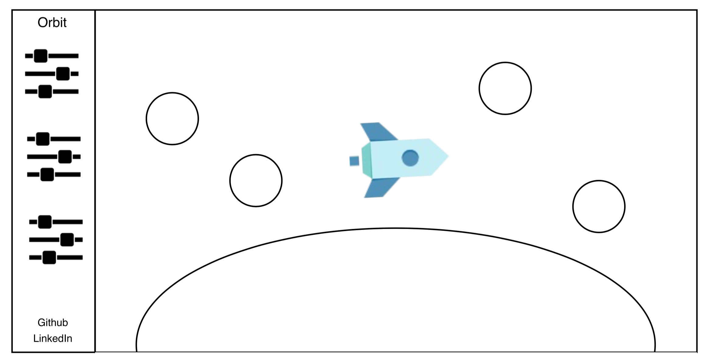

## Orbit

### Background

Orbit follows the journey of a rocket that is circling the moon. The user will be able to toggle the number of asteroids, the camera angle, rocket speed, etc.

### Functionality & MVP  

With this app, users will be able to:

- [ ] Manipulate rocket position with mouse movement, as well as adjust variables that manipulate the environment

This project will include:

- [ ] A production Readme

### Wireframes

This game will consist of a single screen with nav links to the Github repo, my LinkedIn, and the instructional modal. The screen will be set around a rotating planet, with the rocket positioned near the center of the screen. Oncoming asteroids will enter from the right.

### Architecture and Technologies

This project will be implemented with the following technologies:

- Vanilla JavaScript and jQuery for overall structure and game logic
- `Three.js` with `WebGL` for DOM manipulation and rendering

### Implementation Timeline

**Weekend**: Learn about `Three.js`.

**Day 1**: Add the nav bar. Create the scene and lighting.

**Day 2**: Create rocket and asteroid objects and add them to the scene. Animate the scene.

**Day 3**: Add responsiveness to mouse movement and start on range inputs.  

**Day 4**: Continue developing range inputs.
